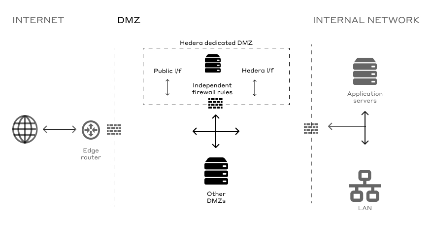

# Node Requirements

The following is provided to help Hedera Governing Council members deploy their permissioned mainnet consensus node. Please note, this information is not intended to apply to Hedera's transition to a permissionless network.

## Minimum Node Requirements

Currently, the Hedera mainnet will perform at a rate determined by the lowest performing node. To ensure a common level of performance minimum hardware, connectivity and hosting requirements have been defined for the initial permissioned, Governing Council nodes.


To ensure accurate conformity with the minimum requirements, please provide node hardware, connectivity, and hosting details to Hedera prior to purchase \(devops@hedera.com\).


Chassis \(hardware nodes only\)

* Dual Power - 1600W minimum, 2000W recommended

Network Connectivity: Single 1-Gigabit / 10-Gigabit Ethernet \(physical connectivity subject to network infrastructure\)

2 x Intel® Xeon® Silver 4116 Processor 12-core 2.10GHz 16.50MB Cache \(85W\)

256 GB PC4-21300 2666MHz DDR4 ECC Registered DIMM

2 x 240GB SSD with RAID 1 for OS Storage

5TB SSD NVMe usable storage

* Single Drive recommended
* Endurance / Mixed Use \(Not Read Intensive\)

Storage performance specifications \(within 10% of performance parameters below\)

* Sequential read: 6200 MB/s
* Random read: 1.08M IOPS
* Sequential write: 3000 MB/s
* Random write: 170K IOPS

Considerations for future expansion \(hardware based deployments\):

* Chassis must be [Nvidia Tesla V100 PCIe certified](https://www.nvidia.com/en-us/data-center/tesla/tesla-qualified-servers-catalog/)
* 1x Nvidia Tesla V100 PCIe 16GB GPU


Reference Configurations available in Appendices B, C, D


### Proxy

Access to the node via public APIs must be mediated by an in-line proxy. Below are the specifications for establishing this proxy.

* 2-CPU
* 2GB RAM
* 100GB storage
* 200Mb/S internet network connectivity with public static IP address
* Docker 18 or higher \(Hedera to provide Docker image with HAProxy\)

### Network Connectivity

Node Connectivity

* 1Gbps internet connectivity – sustained/unmetered
  * Deployed with firewalled access to other mainnet consensus nodes
* Node deployed in dedicated \(isolated\) DMZ network
  * Static IP \(FQDN is not supported\)
  * TCP Port 50111 open to provided whitelist addresses \(other Hedera nodes\)
  * TCP Port 50211 open to communication with assigned HAProxy\(ies\)
  * TCP Port 443 open egress to 0.0.0.0/0
  * TCP Port 22 \(SSH\) open to 35.192.32.50/32 & 18.219.214.181/32

Proxy Connectivity

* Static IP address \(FQDN not supported\)
* 200Mb/s internet connectivity
* TCP Port 50211 open to 0.0.0.0/0
* TCP Port 22 \(SSH\) open to 35.192.32.50/32 & 18.219.214.181/32

### Hosting

* Industry standard hosting requirements for security and availability
  * Tier 1 Data Center Hosting facility
  * SSAE 16 /18, SOC 2 Type 2 compliant
* Hedera will seek to avoid duplicating of hosting providers across Council members

### Software & Installation

* Any 64 bit Long Term Support \(LTS\) Linux distribution
  * Ubuntu
  * Red Hat Enterprise
  * CentOS
  * BSD not supported
* Linux user with sudo privileges, named: `hgcadmin` 
* Public key added to SSH authorized\_keys for user hgcadmin for both node host and proxy\(ies\)

```text
ssh-rsa AAAAB3NzaC1yc2EAAAADAQABAAABAQDDt50KHgircRbqfukIFUElFd6BBSNHdcA7k Qabb4o/6ZbiOSzwVL5yNHVZ6lxrWEy5oDSKT4JJX85Gv8y5EbIh7oFqr5njfDvTylX6QV XnkexW4yOnfuryQOYcnejlnKyMNMUJuCXvj1CVOjB+MR9Zppiuj6eLGKDVydWcXMKSt Fd5w0ZmriOEJvd5O/5J7eYau1gpYZeNaarDOSI27oM8CIDTgg/oQX/SDNN0jX5Y55mh NJw0AmWTgc1K/wQFXnxlhvBpBPaQZAMEF/ZvQttAqH0BCpoUzC0EQ4+Z7NNkBcVr QN667L5zH+ggvzsIeBGAsUjJ4L56191sV1Rc3Qz3 hgcadmin
```


External access from hgcadmin will not be required for ongoing production\(mainnet\). This is temporary to be able to update the configuration of the nodes to support new members and features during the testing and initial production deployment phase.


Once the hardware with base O/S is deployed, please email \(devops@hedera.com\) us the following

* Static IPs of the node interface
* hgcadmin user password

Once received we can test permissions and setup the node accordingly.

## Network Topology /\(Typical Corporate Datacenter Configuration/\)



## Deployment Steps

The following steps outline the process for Council Members to add their consensus node to the mainnet.

1. Initial contact with Council Member and node hosting entity
   1. Identify key individuals and project managers
   2. Establish regular deployment team meeting cadence
2. Conveyance of technical requirements and discussion of deployment options
3. Node platform acquisition
   1. Hardware or virtual instance
   2. Network connectivity
   3. Hosting facility
4. Configuration of operating system on platform
   1. Provisioning of accounts as specified
   2. Provisioning of network access \(firewall rules/access control lists\)
5. Conveyance of credentials to Hedera
   1. Includes any special instructions for permissioned access such as VPNs
   2. Discussion of support and escalation paths between organizations
6. Hedera undertakes configuration review
   1. Platform
   2. Connectivity
7. Deployment of Hedera consensus node software and required supporting libraries
8. Add connection configuration for a Hedera performance testnet
   1. Hedera executes functional, stability and performance tests for all network services
9. Review of test results and determination of preparedness for mainnet connectivity
   1. Review key management documentation as it relates to Council Member's accounts including: fee account, proxy staking account, et al.
   2. Update private keys using provided tools
10. Schedule mainnet connection
11. Mainnet live

